# EASY BUY

### AI-Native Commerce for Razorpay

> **Turn a merchant catalog into an AI-discoverable, AI-transactable storefront — without giving the LLM control of money.**

**Razorpay AI Buildathon 2026 · Track 1 — AI Growth & Agentic Commerce**

---

## 🚀 What is EASY BUY?

**EASY BUY** is an AI commerce agent that takes a buyer from a natural-language shopping request to a **verified Razorpay Test Mode payment**.

A buyer can say:

> *“I need a rugged case for an iPhone 16 under ₹1,500.”*

EASY BUY:

**understands intent → searches the merchant catalog → verifies compatibility & inventory → ranks relevant products → suggests grounded cross-sells → builds the cart → requests explicit approval → re-validates the purchase → creates a Razorpay order → opens Checkout → verifies the webhook → confirms the order → records the audit trail.**

The core invariant is:

> ### **LLM proposes → application validates → user authorizes → Razorpay executes → verified webhook confirms → system audits.**

The LLM handles ambiguity and conversation.

**The application owns commerce truth and payment authority.**

---

## 🎯 Why EASY BUY is Track 1

Track 1 — **AI Growth & Agentic Commerce** — asks builders to use AI to grow merchant commerce and/or make a merchant discoverable and transactable by AI buyers.

EASY BUY directly addresses the **AI-transactable merchant** side, while also providing merchant-growth mechanisms through grounded recommendations and cross-sell/upsell.

| Track 1 requirement         | EASY BUY implementation                                                |
| --------------------------- | ---------------------------------------------------------------------- |
| 🤖 AI buyer                 | Natural-language shopping agent                                        |
| 🛍️ Conversational commerce | Buyer goes from intent → products → cart → payment                     |
| 📚 Agent-readable catalog   | Structured catalog + MCP surface                                       |
| 🔎 Product discovery        | Deterministic catalog search and ranking                               |
| 🎯 Compatibility            | Server-side compatibility validation                                   |
| 📦 Inventory                | Server-authoritative inventory checks                                  |
| ↗️ Upsell / cross-sell      | Merchant-defined related products, filtered by compatibility and stock |
| 🛒 Cart                     | Server-authoritative cart and total                                    |
| 🔐 Explicit authorization   | Buyer must explicitly approve the exact purchase                       |
| 💰 Bounded money movement   | Deterministic Policy Engine                                            |
| 💳 Razorpay transaction     | Real Razorpay Test Mode Checkout                                       |
| 🔔 Payment truth            | Verified Razorpay webhook                                              |
| 🔁 Failure recovery         | Price drift + payment failure handling                                 |
| 📋 Auditability             | Append-only audit events                                               |
| 🌐 AI-to-AI commerce        | MCP server for external AI buyers                                      |
| 📊 Reproducible evaluation  | 270 cases / 3,470 deterministic checks                                 |

**This is not a chatbot that talks about products.**

It is a commerce system in which an AI buyer can actually move from **discovery to transaction**, while deterministic application code controls what is allowed to happen with money.

---

# 🖥️ The product

### AI-native shopping experience

The buyer starts with a natural-language request rather than navigating a traditional catalog manually.

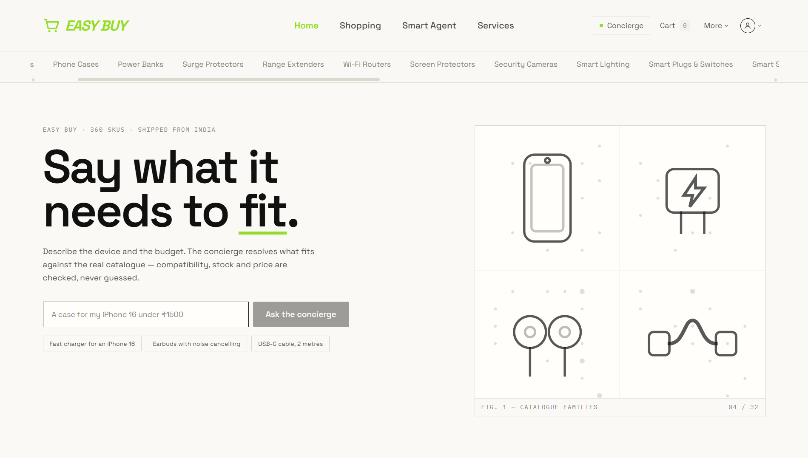

### Conversational AI buyer

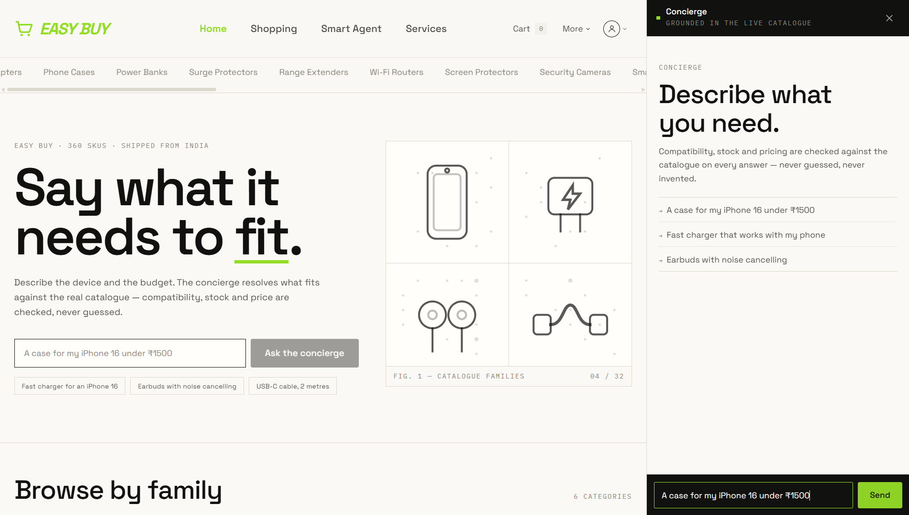

The agent interprets the request and uses bounded application tools rather than directly manipulating payment state.

### Grounded recommendations

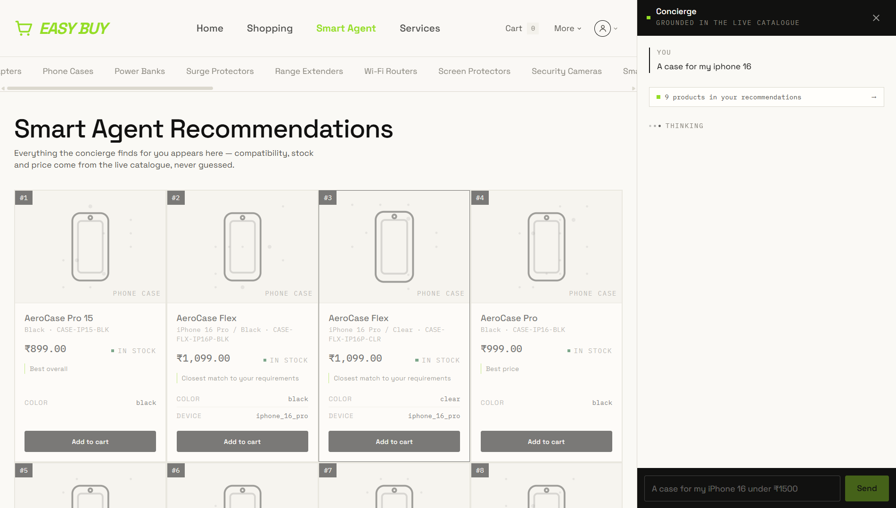

Recommendations are grounded in the merchant catalog and validated by deterministic application logic.

---

# 🛍️ From intent to checkout

The complete human-buyer path is:

```text
Natural-language request
        ↓
AI intent understanding
        ↓
Catalog search
        ↓
Compatibility + inventory
        ↓
Deterministic ranking
        ↓
Grounded recommendation
        ↓
Cart
        ↓
Explicit approval
        ↓
Policy Engine
        ↓
Razorpay Test Mode
        ↓
Verified webhook
        ↓
Confirmed order
        ↓
Audit trail
```

### Active cart

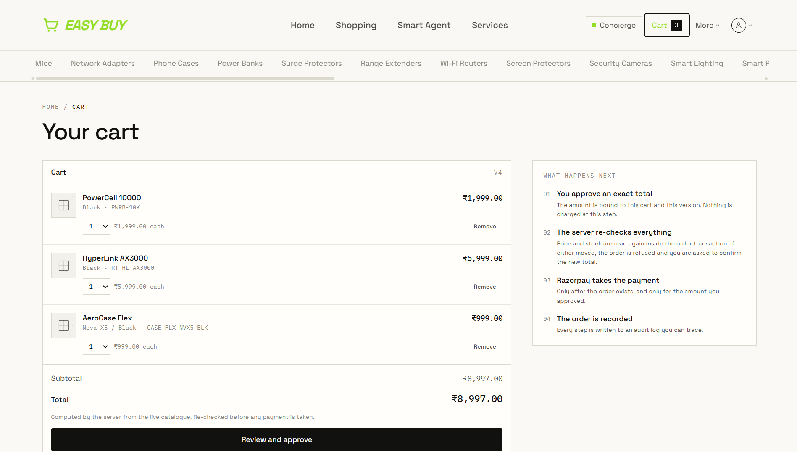

The cart total is calculated by the application, not invented by the model.

---

# 🔐 The most important architectural decision

Most AI commerce systems make the model the center of the transaction.

EASY BUY deliberately does **not**.

### The LLM is a reasoning interface.

### The application is the authority.

| The AI may…                 | The AI may NOT…                  |
| --------------------------- | -------------------------------- |
| Understand natural language | Invent a SKU                     |
| Select tools                | Invent a price                   |
| Search the catalog          | Invent inventory                 |
| Explain recommendations     | Override compatibility           |
| Suggest an upsell           | Change the payable amount        |
| Prepare a cart              | Approve its own purchase         |
| Request payment             | Create a Razorpay order directly |
| Work through MCP            | Declare a payment successful     |

> **Model output is treated as a proposal — never as payment truth.**

---

# 🛡️ Payment safety

The most important payment rule is:

> **The LLM never gets a `create_order` tool.**

The payment boundary is intentionally separated from the agent tool layer.

```text
                  LLM / MCP Buyer
                        │
                        ▼
                Application Services
                        │
             ┌──────────┴──────────┐
             │                     │
       Catalog / Cart       Approval / Mandate
             │                     │
             └──────────┬──────────┘
                        ▼
                DETERMINISTIC
                 POLICY ENGINE
                        │
                 ┌──────┴──────┐
                 │             │
                FAIL          PASS
                 │             │
                 ▼             ▼
               STOP         Razorpay
                             Order
                                │
                                ▼
                             Checkout
                                │
                                ▼
                         Signed Webhook
                                │
                                ▼
                         Payment Truth
                                │
                                ▼
                            Audit Log
```

### Policy Engine

Before money can move, the Policy Engine evaluates deterministic rules covering:

* explicit approval
* approved amount
* current price
* inventory
* transaction spending limit
* cart validity
* ownership
* idempotency
* order state

The transaction is bounded to **₹10,000 per transaction**, and the agent runtime is bounded to **8 tool calls per turn**.

The Policy Engine returns machine-readable reason codes rather than relying on model-generated explanations.

### Policy evidence

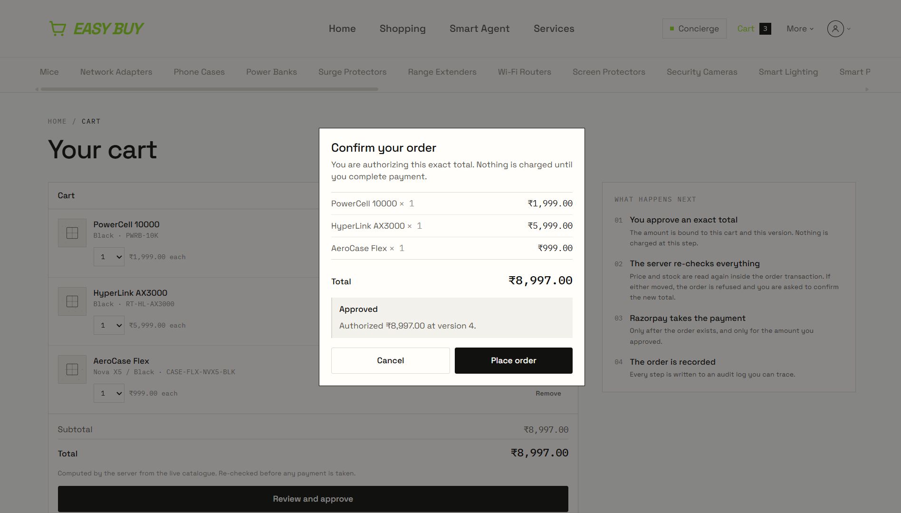

---

# ✋ Explicit approval

The buyer must approve the exact purchase before the payment boundary can be crossed.

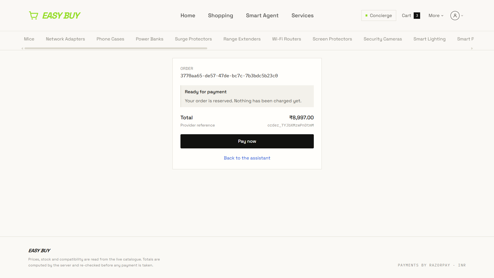

This prevents conversational intent such as:

> “That looks good”

from silently becoming unlimited payment authorization.

---

# 💳 Real Razorpay Test Mode payment

After approval and policy validation, EASY BUY creates a real **Razorpay Test Mode order** and opens Razorpay Checkout.

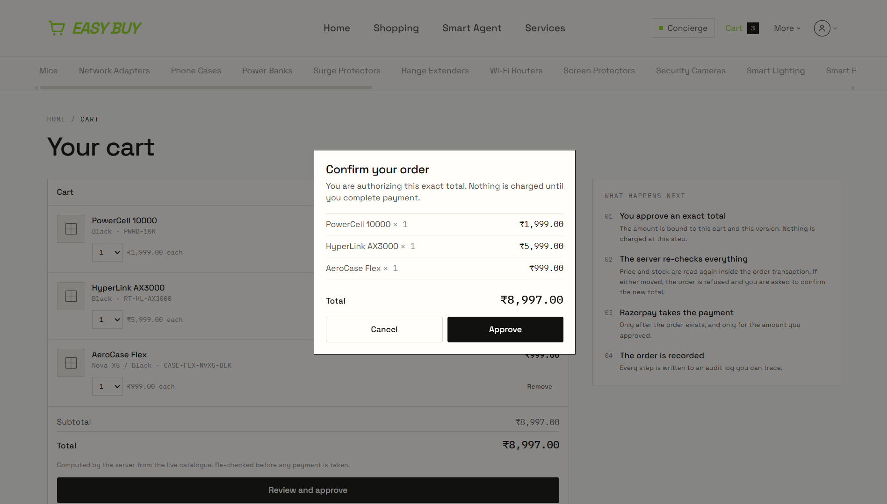

The payment flow is:

```text
Approved cart
      ↓
Policy Engine
      ↓
Razorpay order creation
      ↓
Razorpay Checkout
      ↓
Test payment
      ↓
Signed Razorpay webhook
      ↓
Payment confirmation
      ↓
Order state update
      ↓
Audit event
```

### Payment verification

The demo includes the complete payment sequence through Razorpay Test Mode:

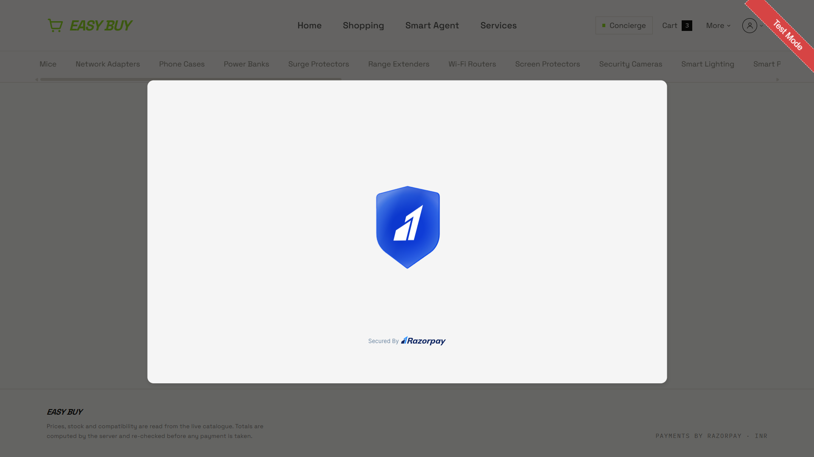

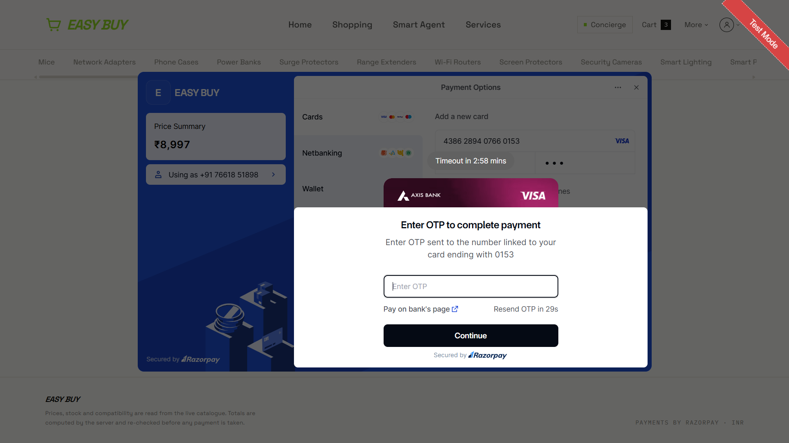

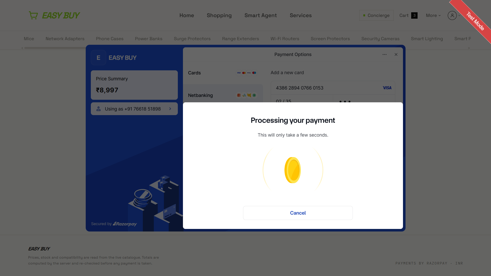

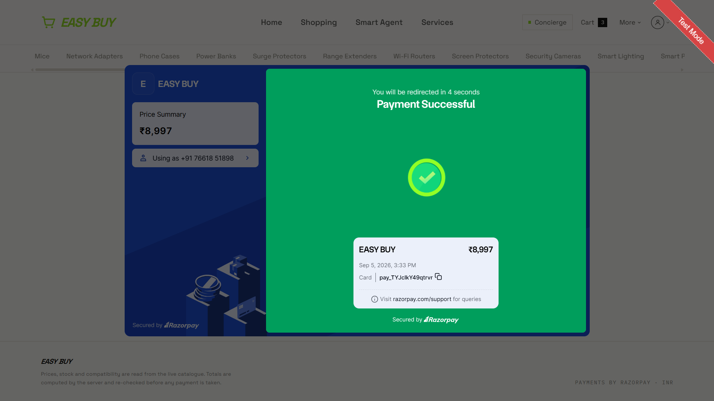

And the corresponding transaction is visible from the provider side:

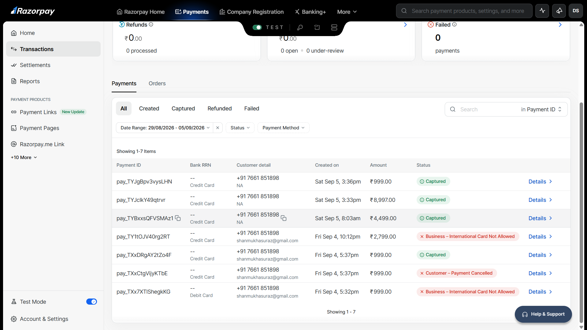

**The repository does not treat frontend state or an LLM response as payment truth.**

A verified Razorpay webhook is the authoritative payment confirmation.

---

# 🔁 Idempotency & duplicate protection

Payment systems cannot assume that every request or webhook happens exactly once.

EASY BUY therefore treats duplicate execution and retry behavior as first-class concerns.

The payment boundary uses idempotency controls and webhook handling so retries do not silently become duplicate orders or payments.

Relevant decisions:

* **ADR-011** — Razorpay order creation boundary
* **ADR-012** — Webhook as payment truth
* **ADR-014** — Price drift recovery

---

# 💥 Failure recovery

A trustworthy commerce agent must demonstrate what happens when reality changes.

EASY BUY has two verified failure paths:

## 1. Price drift after approval

Consider:

```text
Buyer approves:
₹2,499

        ↓

Merchant changes price

₹2,499 → ₹2,799

        ↓

Purchase attempted
```

EASY BUY does **not** silently charge the new amount.

The Policy Engine re-reads the live catalog state and detects the mismatch.

```text
Approval
   ↓
Live price revalidation
   ↓
Price changed?
   │
   ├── NO  → continue
   │
   └── YES
        ↓
     BLOCK
        ↓
No Razorpay order
        ↓
Approval invalidated
        ↓
Fresh approval required
        ↓
Fresh idempotency boundary
```

The buyer's original approval remains bounded to the amount they actually approved.

Implementation:

[`ADR-014 — Price Drift Recovery`](docs/decisions/ADR-014-price-drift-recovery.md)

---

## 2. Payment failure

A real `payment.failed` webhook is also handled.

The order transitions to `PAYMENT_FAILED`, the cart remains intact, and the buyer can retry cleanly.

This means failure is not treated as an exceptional demo-only condition.

It is part of the transaction model.

---

# 📋 Auditability

Every important transaction decision is recorded through the audit layer.

A real transaction can be reconstructed through events such as:

```text
ORDER_CREATED
      ↓
RAZORPAY_ORDER_CREATED
      ↓
PAYMENT_WEBHOOK_RECEIVED
      ↓
PAYMENT_FAILED / PAYMENT_CONFIRMED
      ↓
ORDER_STATE_UPDATED
```

Each event is attributed to the relevant actor such as:

* `SYSTEM`
* `RAZORPAY`
* user

### Merchant activity / audit evidence

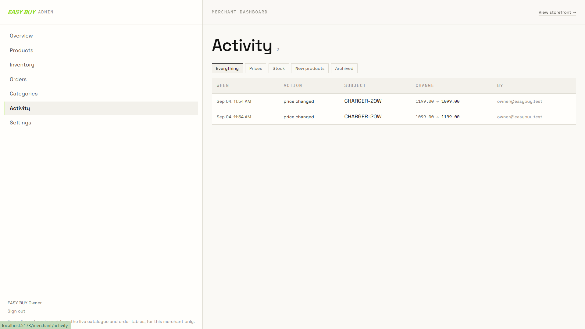

The audit trail exists so the system can answer:

> **What happened?**

and, more importantly:

> **Why was this action allowed or blocked?**

---

# 📈 Merchant growth

EASY BUY is not only a payment interface.

It provides merchant-side value through:

### Product discovery

Natural-language discovery makes the catalog accessible without requiring buyers to understand the merchant's category structure.

### Compatibility-aware recommendations

The agent can identify products that actually satisfy the buyer's stated requirements.

### Grounded cross-sell / upsell

Related products are recorded by the merchant and filtered against compatibility and stock.

The agent does not recommend a product merely because it might increase revenue.

### Merchant dashboard

Merchants can manage and observe:

* catalog
* products
* inventory
* orders
* categories
* pricing
* activity
* revenue analytics

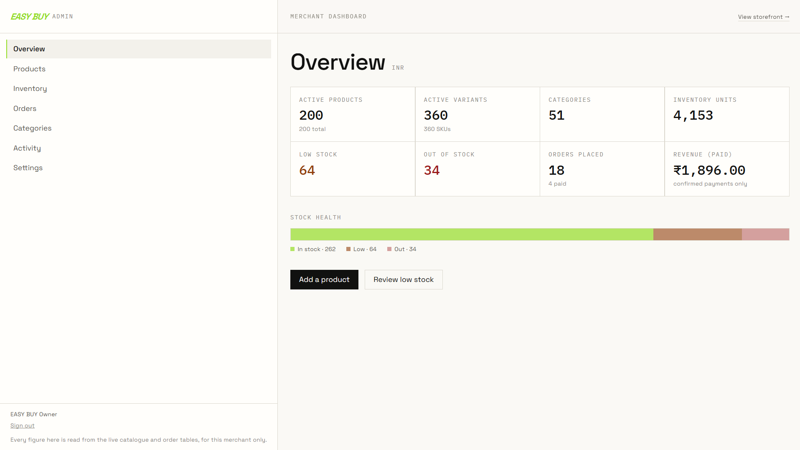

This provides the merchant-side surface required to make the catalog operationally useful to an AI buyer.

---

# 🌐 AI-to-AI commerce with MCP

EASY BUY supports a second transaction path for an **external AI buyer**.

```text
External AI Buyer
       │
       ▼
   MCP Server
       │
       ├── search_catalog
       ├── create_quote
       ├── authorize_and_pay
       └── get_order_status
       │
       ▼
Same commerce services
       │
       ▼
Policy Engine
       │
       ▼
Razorpay
```

The MCP path does **not** bypass the normal payment controls.

### Example

```text
search_catalog(
    "rugged case",
    category="phone_case",
    max_price="1500.00"
)

        ↓

create_quote(
    items=[{
        "sku": "CASE-IP16-BLK",
        "quantity": 1
    }]
)

        ↓

quote total:
₹999.00

        ↓

authorize_and_pay(
    quote_reference,
    authorized_amount="999.00"
)

        ↓

Razorpay order + payment handoff
```

If the external AI authorizes an incorrect amount:

```text
authorized_amount = ₹1.00
actual quote       = ₹999.00

        ↓

REJECTED
TOTAL_CHANGED
```

No payment is created for the invalid authorization.

This is the key property:

> **External AI buyers use the commerce system; they do not bypass it.**

See [`ADR-024`](docs/decisions/ADR-024-mcp-surface-for-ai-buyers.md).

---

# 🧠 AI judgment: where AI belongs

EASY BUY deliberately uses AI where ambiguity exists and deterministic software where correctness matters.

| Problem                        | Authority             |
| ------------------------------ | --------------------- |
| Natural-language understanding | LLM                   |
| Intent extraction              | LLM + schema          |
| Tool selection                 | LLM                   |
| Conversational explanation     | LLM                   |
| Product facts                  | PostgreSQL            |
| Compatibility                  | Deterministic service |
| Inventory                      | Database / service    |
| Recommendation ranking         | Deterministic ranking |
| Cart totals                    | Server                |
| Approval                       | Application state     |
| Payment authorization          | Policy Engine         |
| Price validation               | Server                |
| Payment execution              | Razorpay              |
| Payment confirmation           | Verified webhook      |
| Audit                          | Database              |

This is a deliberate engineering choice:

> **Use AI where reasoning helps. Use deterministic code where correctness matters.**

---

# 🏗️ Architecture

```text
                ┌────────────────────────┐
                │ Buyer / External AI    │
                └────────────┬───────────┘
                             │
                  ┌──────────▼──────────┐
                  │ LLM / MCP Interface │
                  └──────────┬──────────┘
                             │
                  ┌──────────▼──────────┐
                  │ Application Services│
                  │                      │
                  │ Catalog              │
                  │ Compatibility        │
                  │ Inventory            │
                  │ Ranking              │
                  │ Cart                 │
                  │ Approval             │
                  └──────────┬──────────┘
                             │
                  ┌──────────▼──────────┐
                  │  Policy Engine      │
                  │  deterministic      │
                  └───────┬───────┬────┘
                          │       │
                       FAIL       PASS
                          │       │
                          ▼       ▼
                        STOP   Razorpay
                                  │
                                  ▼
                               Checkout
                                  │
                                  ▼
                            Signed Webhook
                                  │
                    ┌─────────────┴─────────────┐
                    ▼                           ▼
              Order State                  Audit Trail
                    │
                    ▼
               PostgreSQL
                    │
                    ▼
            Merchant Dashboard
```

### Authority boundaries

**PostgreSQL**
Owns product and transaction truth.

**LLM layer**
Handles natural language, intent and tool selection.

**Deterministic ranking engine**
Owns relevance.

**Policy Engine**
Owns whether money may move.

**Razorpay integration**
Owns payment execution.

**Verified webhook**
Owns whether payment actually occurred.

**Audit layer**
Owns the reconstruction of important decisions.

---

# 📊 Evaluation

The project includes a dedicated commerce evaluation suite.

| Metric                    |        Result |
| ------------------------- | ------------: |
| Commerce evaluation cases |       **270** |
| Deterministic checks      |     **3,470** |
| Overall                   | **268 / 270** |
| Overall rate              |     **99.3%** |
| Hard-constraint pass rate |      **100%** |
| Authorization pass rate   |      **100%** |

The evaluation checks more than conversational quality.

It covers deterministic commerce properties including:

* constraints
* catalog grounding
* authorization
* transaction boundaries
* failure handling
* payment safety

The remaining two cases expose the known **F-1** limitation described below and are retained as strict expected failures rather than hidden.

See:

[`docs/EVALUATION-REPORT.md`](docs/EVALUATION-REPORT.md)

---

# 🧪 Engineering verification

### Backend

```text
1,711 passed
2 xfailed
0 skipped
```

Runs against a real PostgreSQL test database.

### Frontend

```text
71 tests passing
Typecheck clean
ESLint clean
Production build clean
```

The test architecture also prevents normal tests from reaching a real model or real payment provider.

---

# ⚠️ Honest limitations

EASY BUY is intentionally transparent about what it does **not** claim.

### F-1 — Free-form assistant prose

One evaluation finding remains around free-form assistant prose that is not itself converted into a structured recommendation, order, or payment action.

It does **not** bypass the deterministic commerce/payment path.

The defect remains visible through strict expected failures.

### Growth scope

The project demonstrates:

* conversion
* AI product discovery
* compatibility-aware recommendations
* grounded cross-sell / upsell

It does **not** claim to have a full campaign orchestrator, abandoned-cart recovery system or long-term personalization loop.

### MCP deployment scope

The MCP server is currently a buildathon-grade, single-merchant surface.

The transaction still requires an exact authorization mandate and passes through the same Policy Engine, but a production deployment would require stronger per-buyer identity and authorization.

### Inventory lifecycle

Inventory is validated and re-read under the order transaction, but the current implementation does not decrement inventory after `PAYMENT_CONFIRMED`.

The reservation lifecycle is intentionally deferred and documented in ADR-005.

### Deployment

The project runs locally and uses a public webhook tunnel such as ngrok for Razorpay webhook delivery.

### LLM rate limits

The current Groq free-tier environment can rate-limit multi-turn live demos. The application handles the failure, but the limitation can affect demo latency.

---

# 📋 Track 1 → implementation → evidence

| Requirement                | Implementation                 | Evidence                       |
| -------------------------- | ------------------------------ | ------------------------------ |
| AI buyer                   | Agent runtime                  | `backend/app/agent/`           |
| Merchant catalog           | PostgreSQL                     | `backend/app/db/` + services   |
| Agent-readable catalog     | Structured tools + MCP         | `backend/app/mcp/`             |
| Product discovery          | Catalog service                | `backend/app/services/`        |
| Compatibility              | Deterministic service          | `backend/app/services/`        |
| Inventory validation       | Server-side validation         | Commerce services              |
| Grounded recommendations   | Deterministic ranking          | `backend/app/ranking/`         |
| Cross-sell / upsell        | Merchant-defined relationships | Recommendation layer           |
| Explicit authorization     | Approval service               | Approval state                 |
| Bounded monetary action    | Policy Engine                  | `backend/app/policy/`          |
| Razorpay payment           | Payment adapter                | `backend/app/payments/`        |
| Real Test Mode transaction | Razorpay Checkout              | `pitch-assets/`                |
| Payment confirmation       | Signed webhook                 | Webhook service                |
| Idempotency                | Order/payment boundary         | ADRs + tests                   |
| Failure recovery           | Price drift + payment failure  | ADR-014 + tests                |
| Auditability               | Append-only audit events       | Merchant activity log          |
| Merchant visibility        | Dashboard                      | `frontend/src/pages/merchant/` |
| External AI buyer          | MCP                            | ADR-024                        |
| Reproducible evaluation    | Commerce eval suite            | `backend/tests/evals/`         |

---

# 🎥 5-minute demo path

The recommended demo is proof-oriented rather than a feature tour.

### 1. Product

Show the buyer starting a natural-language request.

### 2. Discovery

Show grounded recommendations and compatibility.

### 3. Cart

Show the authoritative total.

### 4. Authorization

Show explicit approval.

### 5. Policy

Show the deterministic policy decision.

### 6. Razorpay

Open the real Razorpay Test Mode Checkout.

### 7. Payment

Complete the test payment.

### 8. Webhook

Show payment confirmation.

### 9. Failure recovery

Change the price after approval and demonstrate that the stale approval is rejected.

### 10. Audit / merchant

Show the activity trail and merchant dashboard.

### 11. AI-to-AI

Show the MCP transaction path.

The story is:

> **Here is the product → here is the transaction → here is the safety boundary → here is what happens when reality changes → here is the audit trail.**

---

# 🗂️ Repository guide

```text
AI_COMMERCE_AGENT/
│
├── architecture.md
├── docker-compose.yml
├── .env.example
│
├── backend/
│   ├── app/
│   │   ├── agent/          AI orchestration
│   │   ├── ranking/        deterministic recommendation
│   │   ├── policy/         payment policy boundary
│   │   ├── payments/       Razorpay integration
│   │   ├── mcp/            external AI buyer surface
│   │   ├── services/       commerce business logic
│   │   ├── repositories/   database access
│   │   ├── db/             PostgreSQL models/session
│   │   └── api/routes/     HTTP API
│   │
│   └── tests/
│       ├── evals/
│       ├── integration/
│       └── mcp/
│
├── frontend/
│   └── src/
│       ├── api/
│       ├── auth/
│       ├── features/
│       │   ├── chat/
│       │   ├── agent/
│       │   ├── cart/
│       │   ├── checkout/
│       │   └── merchant/
│       └── pages/
│
├── docs/
│   ├── SUBMISSION.md
│   ├── PROJECT_STATE.md
│   ├── DEMO-SCRIPT.md
│   ├── EVALUATION-REPORT.md
│   ├── RUNBOOK.md
│   ├── decisions/
│   ├── audit/
│   ├── bugs/
│   └── development-log/
│
└── pitch-assets/
    ├── 01-homepage.png
    ├── 02-agent.png
    ├── 04-agent-recommended-products.png
    ├── 13-Active-cart.png
    ├── 15-policy-engine-check.png
    ├── 16-approved-the-payment.png
    ├── 17-razorpay.png
    ├── 20-OTP-verification.png
    ├── 22-payment-sucessfull.png
    └── 23-razorpay-testmode-dashboard.png
```

---

# 📚 Evaluator reading path

If you are evaluating the project, start here:

1. [`docs/SUBMISSION.md`](docs/SUBMISSION.md) — Track 1 mapping
2. [`docs/DEMO-SCRIPT.md`](docs/DEMO-SCRIPT.md) — demo sequence
3. [`docs/EVALUATION-REPORT.md`](docs/EVALUATION-REPORT.md) — quantitative evaluation
4. [`docs/PROJECT_STATE.md`](docs/PROJECT_STATE.md) — canonical implementation state
5. [`architecture.md`](architecture.md) — complete architecture

### Safety decisions

* [`ADR-001`](docs/decisions/ADR-001-architecture-invariant.md)
* [`ADR-011`](docs/decisions/ADR-011-razorpay-order-creation-boundary.md)
* [`ADR-012`](docs/decisions/ADR-012-webhook-as-payment-truth.md)
* [`ADR-014`](docs/decisions/ADR-014-price-drift-recovery.md)
* [`ADR-024`](docs/decisions/ADR-024-mcp-surface-for-ai-buyers.md)

### Run it

[`docs/RUNBOOK.md`](docs/RUNBOOK.md)

---

# ⚙️ Run locally

Full setup is documented in [`docs/RUNBOOK.md`](docs/RUNBOOK.md).

### PostgreSQL

```bash
docker compose up -d db
```

### Backend

```bash
cd backend

pip install -e ".[dev]"

alembic upgrade head

python -m app.seed.circuitcraft

python -m app.admin.provision_merchant \
  --email owner@easybuy.test

uvicorn app.main:app \
  --host 127.0.0.1 \
  --port 8004
```

### Frontend

```bash
cd frontend

npm install

echo "VITE_API_BASE_URL=http://127.0.0.1:8004" > .env

npm run dev -- \
  --host 127.0.0.1 \
  --port 5173
```

### MCP

```bash
cd backend

python -m app.mcp
```

### Razorpay webhook tunnel

```bash
ngrok http 8004
```

For Razorpay webhook configuration and Test Mode instruments, see [`docs/RUNBOOK.md`](docs/RUNBOOK.md).

---

# 🔐 Security

Secrets remain backend-only.

The following are never exposed through frontend code, prompts, responses or ordinary logs:

```text
GROQ_API_KEY
RAZORPAY_KEY_SECRET
RAZORPAY_WEBHOOK_SECRET
```

The repository uses:

* `.env.example`
* secret-safe configuration
* log redaction
* frontend secret checks
* tests for secret handling

The Razorpay public key ID may reach the browser at checkout; private credentials do not.

---

# 🧭 Architecture decisions

The project contains **25 Architecture Decision Records**:

**ADR-000** template + **ADR-001 … ADR-024**.

The most important decisions for evaluating EASY BUY are:

| ADR     | Decision                              |
| ------- | ------------------------------------- |
| ADR-001 | Architecture invariant                |
| ADR-002 | PostgreSQL as product source of truth |
| ADR-004 | Deterministic recommendation scoring  |
| ADR-008 | Money representation                  |
| ADR-011 | Razorpay order creation boundary      |
| ADR-012 | Webhook as payment truth              |
| ADR-014 | Price drift recovery                  |
| ADR-018 | Locked Groq LLM provider              |
| ADR-023 | Authentication and authorization      |
| ADR-024 | MCP surface for AI buyers             |

Full index:

[`docs/decisions/README.md`](docs/decisions/README.md)

---

# 🧠 Design principles

### 1. AI is not the source of truth

Product facts come from the database.

### 2. AI is not the payment authority

The Policy Engine decides whether money may move.

### 3. Approval is explicit

The buyer authorizes the exact purchase rather than granting unlimited conversational authority.

### 4. Payment status is server-authoritative

A verified Razorpay webhook determines payment truth.

### 5. Failure is part of the product

Price changes, payment failures and duplicate events are handled deliberately.

### 6. Deterministic logic replaces unnecessary AI

If correctness can be guaranteed with code, code owns it.

### 7. Known limitations stay visible

Evaluation findings are documented rather than hidden.

---

# 🏁 The core idea

Traditional commerce asks:

> **“How do I make my website easier for humans to use?”**

Agentic commerce asks:

> **“How can an AI buyer safely discover, decide and transact with my merchant?”**

EASY BUY answers:

```text
AI understands the buyer
        ↓
Merchant data provides truth
        ↓
Deterministic services validate it
        ↓
Buyer explicitly authorizes
        ↓
Policy Engine controls money
        ↓
Razorpay executes the payment
        ↓
Webhook proves what happened
        ↓
Audit trail records why
```

### The goal is not autonomous money movement.

### The goal is controlled AI participation in commerce.

> **We are not giving an LLM control of payments.**
>
> **We are building a controlled interface through which an AI agent can safely participate in commerce.**

---

## Built for

**Razorpay AI Buildathon 2026**

**Track 1 — AI Growth & Agentic Commerce**

**Python · FastAPI · PostgreSQL · React · TypeScript · Groq · MCP · Razorpay Test Mode**
